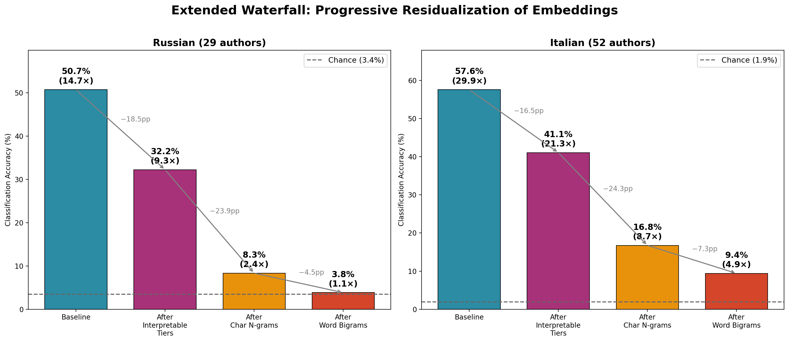

# Stylometry or Embeddings? Authorship Attribution for Russian and Italian Poetry

[](https://doi.org/10.5281/zenodo.21736209)

This repository contains code and data for reproducing the experiments in the paper:

> **Stylometry or Embeddings? Authorship Attribution for Russian and Italian Poetry**
>
> *Maria Levchenko (University of Bologna)*
>
> Journal of Computational Literary Studies


## Overview

We investigate what LLM embeddings encode about authorial style through a residualization analysis of two poetry corpora:
- **Russian**: 5,800 poems by 29 poets (1850-1930)
- **Italian**: 10,400 poems by 52 poets (1200-1900)

### Key Findings

1. **For Russian poetry, residual signal collapses to near chance (1.1×)** after accounting for character n-grams and word bigrams
2. **Character n-grams explain 63% of embedding variance** — far more than all interpretable linguistic features combined (~11%)
3. **Embeddings and stylometry fail on different texts** (39% error overlap, Jaccard), indicating complementarity


## Quick Start

```bash
# Clone repository
git clone https://github.com/mary-lev/stylometry_or_embeddings.git
cd stylometry_or_embeddings

# Install dependencies
pip install -r requirements.txt

# Get the data from Zenodo (~251 MB) and verify it
python download_data.py

# Confirm the setup: both re-derive a published result from the shipped
# artifacts, so they exercise the data and the code without recomputing
python experiments/exp7_waterfall/run_permutation_test.py
python experiments/exp10_embedding_structure/run_ablation.py
```

If those commands succeed, the installation is correct.

Reproducing the paper in full is the next section. Expect roughly six hours
end to end, most of it in two long runs (the Italian waterfall and the Italian
pairwise analysis); individual tables can be reproduced on their own in
minutes.

---

## Getting the Data

**Note:** Large files (embeddings, poems) are hosted on Zenodo due to GitHub size limitations.

[](https://doi.org/10.5281/zenodo.18260458)

`download_data.py` fetches what the experiments need and checksums every file
afterwards. Re-running it is how you confirm an existing download; nothing is
fetched twice.

```bash
python download_data.py              # what the experiments need (~251 MB)
python download_data.py --all        # also the other embedding models (~896 MB)
python download_data.py --verify     # check only, download nothing
python download_data.py --force      # re-download even if files are present
```

See `data/README.md` for detailed documentation.

**Corpora:**
- **Russian**: 29 poets, 200 poems each, with prosodic annotations from Russian National Corpus
- **Italian**: 52 poets, 200 poems each, spanning seven centuries (1200-1900)

**Embeddings:** six models are on Zenodo —
- Gemini text-embedding-001 (3,072 dimensions) — API
- OpenAI text-embedding-3-large (3,072 dimensions) — API
- Voyage-3-large (1,024 dimensions) — API
- Qwen3-Embedding-8B (4,096 dimensions) — Local
- E5-large multilingual (1,024 dimensions) — Local
- BGE-M3 (1,024 dimensions) — Local, Russian only

Figure 1 additionally shows Qwen3-Embedding-0.6B, whose embeddings are not
part of the release; that bar cannot be recomputed.

---

## Requirements

- Python 3.8+
- NumPy >= 1.21.0
- scikit-learn >= 1.0.0
- SciPy >= 1.7.0
- pandas >= 1.3.0
- matplotlib >= 3.4.0

See `requirements.txt` for full dependencies.

---


## Reproducing the Paper

Every table and figure in the paper is produced by a script in this repository,
from the data downloaded above. This section follows the paper's own order.

**The flow is the same each time:** run the command, compare the numbers it
prints against the *Expected* block underneath. Commands take no arguments
unless shown. Runtimes are from one 20-core machine.

Results are written to `experiments/<exp>/results/` and figures to `figures/`.
Both are committed, so you can compare against the published values before
running anything.

### Coverage at a glance

| Paper element | Command | Time |
|---|---|---|
| Table 1 — corpus statistics | *(dataset description, no computation)* | — |
| Figure 1 — model comparison | `exp8a_multi_model_comparison/run.py` + `visualize_model_comparison.py` | 5 min · needs `--all` |
| Table 2 — stylometry methods | `exp0_stylometry_baseline/run.py` | 15 min |
| Table 3 — embeddings vs stylometry | `exp8_combined_features/run.py`, `run_italian.py` | 20 min |
| Figures 2–3 — combined comparison | `exp8a_multi_model_comparison/visualize.py`, `visualize_italian.py` | 5 s · needs `--all` |
| §Binary Attribution | `exp4_multiclass/run.py`, `exp2_binary_pairs/run.py`, `run_italian.py`, `analyze_method_differences.py` | 1 h |
| Table 4 — text length | `exp4_multiclass/run_length_sensitivity.py` | 10 min |
| Figure 4 — error by length | `exp2_binary_pairs/analyze_method_differences_italian.py`, then `plot_binary_error_by_length.py` | 2–3 h |
| Table 5 — residualization waterfall | `exp7_waterfall/run_extended.py`, `run_italian_extended.py` | 50 min |
| Figures 5–6 — waterfall | `exp7_waterfall/make_waterfall_figures.py` | 2 s |
| §Permutation test | `exp7_waterfall/run_permutation_test.py` | 2 s |
| Table 6 — continuous probes | `exp7_waterfall/probe_discriminative_features.py` | 10 min |
| Table 7 — classification probes | `exp5_interpretability/run.py` | 3 min |
| Table 8 — frequency bands | `exp7_waterfall/analyze_frequency_bands.py` | 10 min |
| Table 9 — cross-topic | `exp5_interpretability/run_cross_topic.py` | 5 min |
| §Perturbation analysis | `exp10_embedding_structure/run_ablation.py` | 2 s |
| Table 10 — bidirectional residuals | `exp8_combined_features/analyze_residualization.py` | 5 min |
| §Error overlap | `exp4_multiclass/analyze_errors_comparison.py` | 20 min |
| Table 11 — error by length | `exp2_binary_pairs/analyze_method_differences.py` *(same run as above)* | — |
| §Linear vs kernel | `exp7_waterfall/test_nonlinear_tiers.py` | 20 min |

`python download_data.py --all` is needed only for Figure 1, the two
combined-comparison figures, and the optional Qwen3-8B columns of Table 5.
Everything else runs on the default download.

---

### Paper §Data

#### Figure 1 — Embedding Model Comparison

```bash
python download_data.py --all       # this comparison needs every model
python experiments/exp8a_multi_model_comparison/run.py
python experiments/exp8a_multi_model_comparison/run_italian.py
python experiments/exp8a_multi_model_comparison/visualize_model_comparison.py
```

**Expected** — `figures/embedding_model_comparison.png`


| Model | Russian | Italian |
|-------|---------|---------|
| Gemini text-embedding-001 | **61.3%** | **67.1%** |
| OpenAI text-embedding-3-large | 56.1% | 65.4% |
| Voyage-3-large | 51.6% | 59.4% |
| Qwen3-Embedding-8B | 50.8% | 57.6% |
| E5-large | 47.2% | 61.3% |
| BGE-M3 | 41.9% | — |
| Qwen3-Embedding-0.6B | 35.8% | — |

Chance is 3.4% (Russian) and 1.9% (Italian). Qwen3-Embedding-0.6B is **not**
in the Zenodo release, so that bar cannot be recomputed; the script skips it
and reports which models were missing.

---

### Paper §Results

#### Table 2 — Stylometric methods

```bash
python experiments/exp0_stylometry_baseline/run.py
```

**Expected** (Russian; the script prints Italian too)

| Method | Accuracy |
|--------|----------|
| Full combined | 61.7% |
| Char 3-grams + function words | 59.2% |
| Char n-grams (2–4) | 58.3% |
| Char 3-grams | 57.8% |
| Word n-grams (1–2) | 33.8% |
| MFW + Logistic Regression | 19.2% |
| Cosine Delta | 19.0% |
| Function words | 16.2% |
| Burrows' Delta (100 MFW) | 13.0% |
| Burrows' Delta (500 MFW) | 7.0% |
| *Chance* | *3.4%* |

#### Table 3 — Embeddings, stylometry, and their combination

```bash
python experiments/exp8_combined_features/run.py           # Russian
python experiments/exp8_combined_features/run_italian.py   # Italian
```

**Expected**

| Method | Russian | Italian |
|--------|---------|---------|
| Embeddings (Gemini) | 61.3% ± 1.3% | 67.1% ± 0.5% |
| Stylometry (char 3-grams + function words) | 59.2% ± 1.1% | 79.7% ± 1.3% |
| **Combined** | **70.5% ± 0.9%** | **81.8% ± 1.1%** |
| *Chance* | *3.4%* | *1.9%* |

#### Figures 2–3 — Combined comparison across models

```bash
python experiments/exp8a_multi_model_comparison/visualize.py          # Russian
python experiments/exp8a_multi_model_comparison/visualize_italian.py  # Italian
```

Needs `exp8a/run.py` and `run_italian.py` from Figure 1 above.

**Expected** — stylometry baseline 59.4% (Russian) and 80.4% (Italian);
Gemini combined 71.2% and 82.2%.


#### §Binary Attribution

```bash
python experiments/exp4_multiclass/run.py                   # multiclass + confusion matrix
python experiments/exp2_binary_pairs/run.py                 # 406 Russian pairs
python experiments/exp2_binary_pairs/run_italian.py         # 1,326 Italian pairs
python experiments/exp2_binary_pairs/analyze_method_differences.py
```

**Expected** — mean pairwise accuracy over all pairs is 89.6% (Russian). The
paper reports the *per-poem* average instead, which
`analyze_method_differences.py` prints: **93.8%** embeddings and **94.5%**
stylometry for Russian (96.1% / 98.5% for Italian, see Table 11).

#### Table 4 — Effect of text length

```bash
python experiments/exp4_multiclass/run_length_sensitivity.py
```

**Expected**

| Concatenation | Words | Gemini Embeddings | Stylometry |
|---------------|-------|-------------------|------------|
| 1 poem | 100 | 61.3% | 57.8% |
| 5 poems | 502 | 95.3% | 96.2% |
| 10 poems | 1,004 | 99.1% | 99.5% |
| 20 poems | 2,008 | 99.7% | 100.0% |

The stylometry column here is char 3-grams alone, which is why 1 poem reads
57.8% rather than the 59.2% of Table 2's char3+function-words row.

#### Figure 4 — Binary error by text length

The Russian half comes from the §Binary Attribution run above. The figure has
an Italian panel too, which needs the Italian pairwise analysis:

```bash
python experiments/exp2_binary_pairs/analyze_method_differences_italian.py   # 2-3 h
python experiments/exp2_binary_pairs/plot_binary_error_by_length.py
```

**Expected** — both panels; overall 93.8% / 94.5% (Russian) and
96.1% / 98.5% (Italian).


---

### Paper §Embeddings Deconstruction: Residualization Waterfall

#### Table 5 — Residualization waterfall (main result)

```bash
python experiments/exp7_waterfall/run_extended.py             # Russian, ~10 min
python experiments/exp7_waterfall/run_italian_extended.py     # Italian, ~40 min

# The Qwen3-8B columns (optional; needs `download_data.py --all`)
python experiments/exp7_waterfall/run_extended.py --embedding-model qwen8b
python experiments/exp7_waterfall/run_italian_extended.py --embedding-model qwen8b
```

**Expected**

| Stage | RU Gemini | RU Qwen3-8B | IT Gemini | IT Qwen3-8B |
|-------|-----------|-------------|-----------|-------------|
| Baseline embeddings | 61.3% | 50.7% | 67.0% | 57.6% |
| After interpretable (T1–T4) | 40.0% | 32.2% | 46.0% | 41.1% |
| After char n-grams (T5) | 10.2% | 8.3% | 16.1% | 16.8% |
| After word bigrams (T6) | 3.8% | 4.0% | 8.7% | 9.5% |
| **Final residual** | **3.8%** | **3.8%** | **8.9%** | **9.4%** |
| **Lift vs. chance** | **1.1×** | **1.1×** | **4.6×** | **4.9×** |
| *Chance* | *3.4%* | *3.4%* | *1.9%* | *1.9%* |

#### Figures 5–6 — Waterfall

```bash
python experiments/exp7_waterfall/make_waterfall_figures.py
```

Runs immediately from the committed results; re-run the waterfalls above first
if you want figures from your own run.

**Expected** — `figures/waterfall_figure.png` (Gemini) and
`waterfall_figure_qwen.png` (Qwen3-8B), each with a Russian and an Italian panel.




#### §Permutation test — is the residual above chance?

```bash
python experiments/exp7_waterfall/run_permutation_test.py
python experiments/exp7_waterfall/run_permutation_test.py --language italian
```

**Expected**

| | Russian | Italian |
|---|---------|---------|
| Null mean | 3.4% | 1.9% |
| Null 95% CI | [3.0%, 3.9%] | [1.7%, 2.2%] |
| Observed residual | 3.9% | 8.9% |
| p-value | ~0.06 | < 0.001 |
| Within null 95% CI | yes | no |
| Conclusion | **not** above chance | above chance |

The 1,000 null accuracies are stored in the results files, so this re-derives
the test in seconds. For Russian the null is dense right at the residual, so
the exact p moves with the residual's second decimal (3.78 / 3.80 / 3.86%
give p = 0.089 / 0.080 / 0.058); all are above 0.05 and inside the CI, so the
conclusion is unaffected. `--recompute` redoes the permutations from scratch
(~3.5 h Russian, ~7 h Italian) and is not needed.

---

### Paper §What Do Embeddings Encode? (Probing Analysis)

#### Table 6 — Continuous property probes (Ridge regression)

```bash
python experiments/exp7_waterfall/probe_discriminative_features.py
```

**Expected**

| Property | R² | Encoding |
|----------|-----|----------|
| Vocabulary diversity (1–100 MFW) | 0.77 | Strong |
| Vocabulary diversity (100–500 MFW) | 0.68 | Strong |
| Vocabulary diversity (500–2000 MFW) | 0.63 | Strong |
| Exclamation rate | 0.53 | Moderate |
| Ellipsis rate | 0.44 | Moderate |
| Em-dash rate | 0.30 | Moderate |
| Hyphen rate | −0.37 | Not encoded |
| Colon rate | < 0 | Not encoded |

#### Table 7 — Classification probes (logistic regression)

```bash
python experiments/exp5_interpretability/run.py
```

**Expected**

| Property | Type | Accuracy | Chance | Lift |
|----------|------|----------|--------|------|
| Topic (Inner vs. Nature) | Semantic | 81.3% | 50% | 1.6× |
| Meter (Iamb vs. Trochee) | Prosodic | 65.1% | 50% | 1.3× |
| Feet (4 vs. 5) | Prosodic | 63.3% | 50% | 1.3× |
| Rhyme (ABAB vs. AABB) | Prosodic | 61.0% | 50% | 1.2× |
| Clausula (regular vs. free) | Prosodic | 56.2% | 50% | 1.1× |
| Meter (5-class) | Prosodic | 32.8% | 20% | 1.6× |

Embeddings encode semantic content (topic 81%) more strongly than prosodic
structure (56–65%).

#### Table 8 — Vocabulary frequency bands

```bash
python experiments/exp7_waterfall/analyze_frequency_bands.py
```

**Expected**

| Frequency band | Word type | Accuracy |
|----------------|-----------|----------|
| 1–100 | Function words | 76.4% |
| 100–500 | Style markers | 76.6% |
| 500–2000 | Topic vocabulary | **77.6%** |
| 2000–5000 | Rare vocabulary | 74.0% |

The prose pattern inverts: topic vocabulary is the most author-discriminative
band for poetry, not function words.

#### Table 9 — Cross-topic validation

```bash
python experiments/exp5_interpretability/run_cross_topic.py
```

**Expected**

| Condition | Accuracy | Δ from baseline |
|-----------|----------|-----------------|
| Baseline (random CV) | 61.3% | — |
| Leave-one-topic-out | 55.8% | −5.5 pp |
| Within-topic | 55.5% | −5.8 pp |
| **Cross-topic** | **35.7%** | **−25.6 pp** |

#### §Perturbation analysis — what moves an embedding?

```bash
python experiments/exp10_embedding_structure/run_ablation.py
```

**Expected**

| Modification | Cosine distance from original |
|--------------|-------------------------------|
| Mask content words | **0.1337** ± 0.0243 |
| Shuffle word order | 0.0266 ± 0.0081 |
| Shuffle line order | 0.0201 ± 0.0092 |
| Remove punctuation | 0.0191 ± 0.0055 |
| Lowercase | 0.0042 ± 0.0030 |

Masking content words moves embeddings ~5× further than shuffling word order.

The perturbed texts are generated by the script and so cannot be shipped
pre-embedded; the per-poem cosine distances are shipped instead, and the table
above is recomputed from them. `--regenerate` re-embeds through the Gemini API
(1,450 calls, costs money) and is not needed.

---

### Paper §How Do Methods Differ? (Complementarity Analysis)

#### Table 10 — Bidirectional residualization

```bash
python experiments/exp8_combined_features/analyze_residualization.py
python experiments/exp8_combined_features/analyze_residualization.py --language italian
```

**Expected** — Russian: embeddings retain 12.5% accuracy (3.6× chance) after
removing stylometry, while stylometry retains 7.6% (2.2×) after removing
embeddings. Italian is balanced at 19.1% / 19.2%.

#### §Error overlap and linearity

```bash
python experiments/exp4_multiclass/analyze_errors_comparison.py
python experiments/exp7_waterfall/test_nonlinear_tiers.py
```

**Expected** — error overlap (Jaccard) **39%**, stylometry/TTR correlation
**−0.16**; and linear Ridge residualization reduces attribution to **4.34%**
where an RBF kernel leaves **47.76%**, confirming the stylistic signal is
linearly accessible.

#### Table 11 — Binary error rates by text length

Already produced by the §Binary Attribution run above — this table and Figure 4
come from the same `method_differences_gemini.json`, so there is no need to run
it again.

**Expected** (Russian, Gemini)

| Length bin | N poems | Embedding error | Stylometry error |
|------------|---------|-----------------|------------------|
| Very short (≤30 words) | 252 | 10.2% | 13.3% |
| Short (31–50) | 822 | 8.6% | 8.9% |
| Medium (51–80) | 1,804 | 7.3% | 6.2% |
| Medium–long (81–120) | 1,590 | 5.1% | 4.2% |
| Long (121–200) | 922 | 4.4% | 2.9% |
| Very long (>200) | 410 | 2.9% | 2.3% |

---

## Repository Structure

```
.
├── data/                 # small files are committed; large ones come from Zenodo
│   ├── README.md                     # data documentation
│   ├── russian/          # 5,800 poems by 29 poets
│   │   ├── dataset_metadata.json     # author list, parameters      [committed]
│   │   ├── labels.npy                # author index per poem        [committed]
│   │   ├── prosody.json              # RNC prosodic annotations     [committed]
│   │   ├── poems.json                # texts                        [Zenodo]
│   │   ├── linguistic_features.json  # POS, morphology, deprels     [Zenodo]
│   │   └── embeddings_*.npy          # gemini, openai, voyage,      [Zenodo]
│   │                                 #   qwen8b, e5-large, bge-m3
│   └── italian/          # 10,400 poems by 52 poets
│       ├── dataset_metadata.json                                   [committed]
│       ├── labels.npy                                              [committed]
│       ├── poems.json                                              [Zenodo]
│       ├── linguistic_features.json                                [Zenodo]
│       └── embeddings_*.npy          # gemini, openai, voyage,      [Zenodo]
│                                     #   qwen8b, e5-large
│
├── src/                  # Core library
│   ├── data_loader.py    # loads a corpus, merges prosody + linguistic features
│   ├── features.py       # feature extraction across the six tiers
│   ├── statistical_tests.py
│   └── ...
│
├── experiments/          # Experiment scripts + pre-computed results
│   ├── exp0_stylometry_baseline/      # Table 2
│   ├── exp2_binary_pairs/             # binary attribution, error by length
│   ├── exp4_multiclass/               # multiclass, text length, error overlap
│   ├── exp5_interpretability/         # classification probes, cross-topic
│   ├── exp7_waterfall/                # waterfall, continuous probes,
│   │                                  #   frequency bands, permutation test
│   ├── exp8_combined_features/        # combined features, bidirectional
│   ├── exp8a_multi_model_comparison/  # model comparison + its figures
│   └── exp10_embedding_structure/     # perturbation analysis
│
├── figures/              # the six paper figures, each regenerated from a
│                         #   results file (methods-euler-final.png is a
│                         #   hand-drawn schematic, not generated)
│
├── download_data.py      # fetch + verify the Zenodo data
├── prepare_for_submission.py  # split large files out for the Zenodo deposit
├── requirements.txt      # Python dependencies
├── CITATION.cff          # citation metadata
├── .zenodo.json          # Zenodo deposit metadata
└── LICENSE               # MIT License
```

---

## Feature Tiers

Our residualization waterfall uses 6 feature tiers:

| Tier | Features | Description |
|------|----------|-------------|
| 1 | 20 | **Surface**: length, punctuation, TTR |
| 2 | 40 | **Content**: TF-IDF + LDA topics |
| 3 | 100 | **Grammar**: POS, morphology, dependencies |
| 4 | 15 | **Prosody**: meter, rhyme, clausula (Russian only) |
| 5 | 2,000 | **Character n-grams** (2-4) |
| 6 | 2,000 | **Word bigrams** |

---


## Citation

If you use this code or data, please cite:

```bibtex
@article{levchenko2026stylometry,
  title={Stylometry or Embeddings? Authorship Attribution for Russian and Italian Poetry},
  author={Levchenko, Maria},
  journal={Journal of Computational Literary Studies},
  year={2026}
}
```

The code itself can be cited via its Zenodo archive: [10.5281/zenodo.21736209](https://doi.org/10.5281/zenodo.21736209).

---

## License

This code is released under the MIT License. See `LICENSE` for details.

The poem texts are sourced from publicly available corpora (PoeTree project).
Embeddings are provided for research purposes only.
