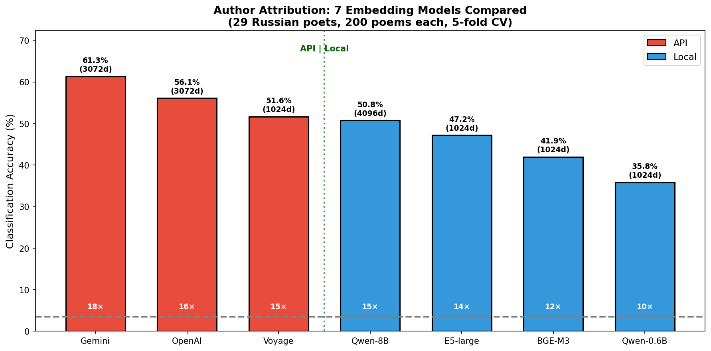
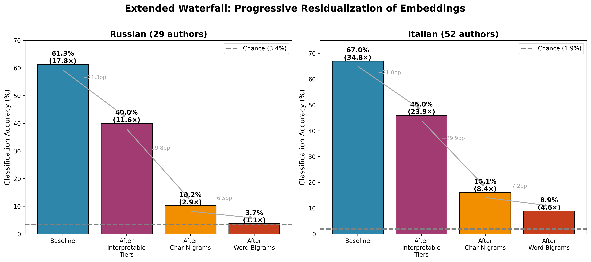
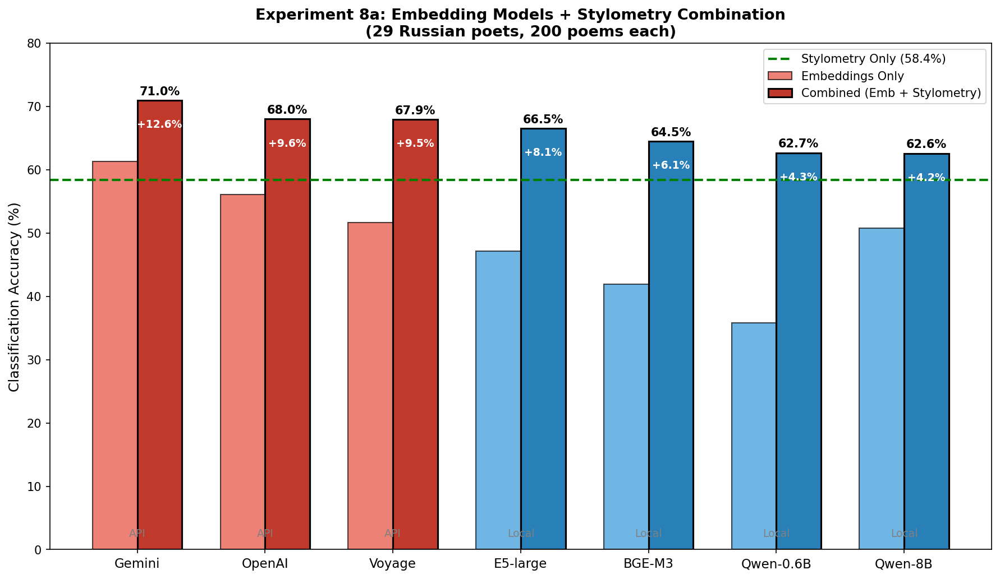
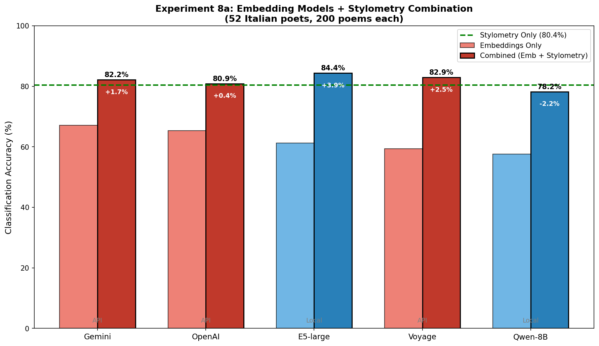
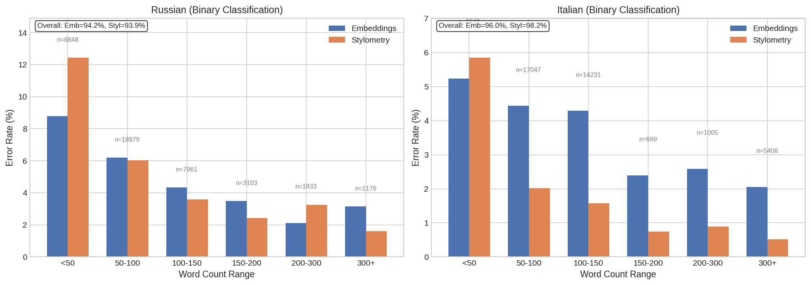

# Stylometry or Embeddings? Authorship Attribution for Russian and Italian Poetry

[](https://doi.org/10.5281/zenodo.21736209)

This repository contains code and data for reproducing the experiments in the paper:

> **Stylometry or Embeddings? Authorship Attribution for Russian and Italian Poetry**
>
> *Maria Levchenko (University of Bologna)*
>
> Journal of Computational Literary Studies


## Overview

We investigate what LLM embeddings encode about authorial style through a residualization analysis of two poetry corpora:
- **Russian**: 5,800 poems by 29 poets (1850-1930)
- **Italian**: 10,400 poems by 52 poets (1200-1900)

### Key Findings

1. **For Russian poetry, residual signal collapses to near chance (1.1×)** after accounting for character n-grams and word bigrams
2. **Character n-grams explain 44% of embedding variance** — more than all linguistic features combined
3. **Embeddings and stylometry fail on different texts** (31% overlap), indicating complementarity


## Quick Start

```bash
# Clone repository
git clone https://github.com/mary-lev/stylometry_or_embeddings.git
cd stylometry_or_embeddings

# Install dependencies
pip install -r requirements.txt

# Download data from Zenodo (embeddings + poems + linguistic features, ~251 MB for minimal)
python download_data.py --minimal    # Required files only
# OR
python download_data.py --all        # All embedding models (~896 MB)

# Run main waterfall experiment
python experiments/exp7_waterfall/run_extended.py --embedding-model gemini
```

---

## Data

**Note:** Large files (embeddings, poems) are hosted on Zenodo due to GitHub size limitations.

[](https://doi.org/10.5281/zenodo.18260458)

The `download_data.py` script automatically downloads and verifies all required files:

```bash
python download_data.py --minimal    # Required files only (~251 MB)
python download_data.py --all        # All embedding models (~896 MB)
python download_data.py --verify     # Check existing files
```

See `data/README.md` for detailed documentation.

**Corpora:**
- **Russian**: 29 poets, 200 poems each, with prosodic annotations from Russian National Corpus
- **Italian**: 52 poets, 200 poems each, spanning seven centuries (1200-1900)

**Embeddings (6 models):**
- Gemini text-embedding-001 (3,072 dimensions) — API
- OpenAI text-embedding-3-large (3,072 dimensions) — API
- Voyage-3-large (1,024 dimensions) — API
- Qwen3-Embedding-8B (4,096 dimensions) — Local
- E5-large multilingual (1,024 dimensions) — Local
- BGE-M3 (1,024 dimensions) — Local, Russian only

---

## Requirements

- Python 3.8+
- NumPy >= 1.21.0
- scikit-learn >= 1.0.0
- SciPy >= 1.7.0
- pandas >= 1.3.0
- matplotlib >= 3.4.0

See `requirements.txt` for full dependencies.

---


## Reproducing Results

### Figure 1: Embedding Model Comparison

```bash
python experiments/exp8a_multi_model_comparison/run.py
python experiments/exp8a_multi_model_comparison/run_italian.py
```

Pre-computed results: `experiments/exp8a_multi_model_comparison/results/`

**Expected output:**



| Model | Russian Accuracy | Italian Accuracy |
|-------|-----------------|------------------|
| Gemini text-embedding-001 | **61.3%** | **67.1%** |
| Voyage-3-large | 55.3% | 61.2% |
| OpenAI text-embedding-3-large | 55.9% | 59.8% |
| Qwen3-Embedding-8B | 50.7% | 57.6% |
| E5-large | 42.1% | 48.3% |
| BGE-M3 | 38.9% | 45.7% |

---

### Table 3: Waterfall Residualization (Main Result)

```bash
# Russian corpus with Gemini embeddings
python experiments/exp7_waterfall/run_extended.py --embedding-model gemini

# Russian corpus with Qwen3-8B embeddings
python experiments/exp7_waterfall/run_extended.py --embedding-model qwen8b

# Italian corpus
python experiments/exp7_waterfall/run_italian_extended.py --embedding-model gemini
```

Pre-computed results: `experiments/exp7_waterfall/results/`

**Expected output:**



| Stage | RU Gemini | RU Qwen3-8B | IT Gemini | IT Qwen3-8B |
|-------|-----------|-------------|-----------|-------------|
| **Baseline embeddings** | 61.3% | 50.7% | 67.0% | 57.6% |
| After interpretable (T1-T4) | 40.0% | 32.2% | 46.0% | 41.1% |
| After char n-grams (T5) | 10.2% | 8.3% | 16.1% | 16.8% |
| After word bigrams (T6) | 3.9% | 4.0% | 8.7% | 9.5% |
| **Final residual** | **3.7%** | **3.9%** | **8.9%** | **9.4%** |
| | | | | |
| **Final lift vs. chance** | **1.1×** | **1.1×** | **4.6×** | **4.9×** |
| **Total R² explained** | **80.1%** | **79.9%** | **85.1%** | **74.4%** |
| Chance level | 3.4% | 3.4% | 1.9% | 1.9% |

**Key insight**: For Russian, the residual drops to chance after removing character-level features.

---

### Table 2: Stylometry Baseline & Combined Results

```bash
python experiments/exp0_stylometry_baseline/run.py
python experiments/exp8_combined_features/run.py
python experiments/exp8_combined_features/run_italian.py
```

Pre-computed results: `experiments/exp8_combined_features/results/`

**Expected output:**





| Method | Russian (29 authors) | Italian (52 authors) |
|--------|---------------------|----------------------|
| Embeddings (Gemini) | 61.3% ± 1.3% | 67.1% ± 0.5% |
| Stylometry | 59.2% ± 1.1% | 79.7% ± 1.3% |
| **Combined** | **70.5% ± 0.9%** | **81.8% ± 1.1%** |
| Chance | 3.4% | 1.9% |

---

### Table 4: Effect of Text Length

```bash
python experiments/exp4_multiclass/run_length_sensitivity.py
```

Pre-computed results: `experiments/exp4_multiclass/results/`

**Expected output:**



| Concatenation | Words | Gemini Embeddings | Stylometry |
|---------------|-------|-------------------|------------|
| 1 poem | 100 | 61.3% | 57.8% |
| 5 poems | 502 | 95.3% | 96.2% |
| 10 poems | 1,004 | 99.1% | 99.5% |
| 20 poems | 2,008 | 99.7% | 100.0% |

**Finding**: Text length is the primary limiting factor for single-poem attribution.

---

### Tables 6-7: Probing Analysis

```bash
python experiments/exp5_interpretability/run.py
```

Pre-computed results: `experiments/exp5_interpretability/results/probing_results.json`

**Expected output:**

#### Continuous Properties (Ridge Regression)

| Property | R² | Encoding |
|----------|-----|----------|
| Vocabulary diversity (500-2000 MFW) | 0.77 | Strong |
| Vocabulary diversity (100-500 MFW) | 0.68 | Strong |
| Vocabulary diversity (1-100 MFW) | 0.63 | Strong |
| Exclamation rate | 0.53 | Moderate |
| Ellipsis rate | 0.44 | Moderate |
| Em-dash rate | 0.30 | Moderate |

#### Classification Properties (Logistic Regression)

| Property | Type | Accuracy | Chance | Lift |
|----------|------|----------|--------|------|
| Topic (Inner vs. Nature) | Semantic | 81.3% | 50% | 1.6× |
| Rhyme (ABAB vs. AABB) | Prosodic | 70.1% | 50% | 1.4× |
| Meter (Iamb vs. Trochee) | Prosodic | 67.5% | 50% | 1.4× |
| Feet (4 vs. 5) | Prosodic | 66.0% | 50% | 1.3× |

**Finding**: Embeddings encode semantic content (topic: 81%) more strongly than prosodic structure (58-70%).

---

### Table 8: Cross-Topic Validation

```bash
python experiments/exp5_interpretability/run_cross_topic.py
```

Pre-computed results: `experiments/exp5_interpretability/results/cross_topic_validation_gemini.json`

**Expected output:**

| Condition | Accuracy | Δ from baseline |
|-----------|----------|-----------------|
| Baseline (random CV) | 61.3% | — |
| Leave-one-topic-out | 55.8% | -5.5 pp |
| Within-topic | 55.5% | -5.8 pp |
| **Cross-topic** | **35.7%** | **-25.6 pp** |

**Finding**: ~40% of signal is topic-dependent, ~60% reflects genuine stylistic patterns.

---

## Repository Structure

```
.
├── data/                 # Downloaded from Zenodo (see download_data.py)
│   ├── russian/          # Russian poetry corpus (5,800 poems)
│   │   ├── embeddings_gemini.npy     # 68 MB
│   │   ├── embeddings_openai.npy     # 136 MB
│   │   ├── embeddings_voyage.npy     # 23 MB
│   │   ├── embeddings_qwen8b.npy     # 91 MB
│   │   ├── embeddings_e5-large.npy   # 23 MB
│   │   ├── embeddings_bge-m3.npy     # 23 MB
│   │   ├── poems.json
│   │   └── linguistic_features.json
│   └── italian/          # Italian poetry corpus (10,400 poems)
│       ├── embeddings_gemini.npy     # 122 MB
│       ├── embeddings_openai.npy     # 122 MB
│       ├── embeddings_voyage.npy     # 41 MB
│       ├── embeddings_qwen8b.npy     # 163 MB
│       ├── embeddings_e5-large.npy   # 41 MB
│       ├── poems.json
│       └── linguistic_features.json
│
├── src/                  # Core library
│   ├── data_loader.py    # Data loading utilities
│   ├── features.py       # Feature extraction (175 features)
│   ├── statistical_tests.py
│   └── ...
│
├── experiments/          # Experiment scripts + pre-computed results
│   ├── exp0_stylometry_baseline/
│   ├── exp2_binary_pairs/
│   ├── exp4_multiclass/
│   ├── exp5_interpretability/
│   ├── exp7_waterfall/
│   ├── exp8_combined_features/
│   └── exp8a_multi_model_comparison/
│
├── figures/              # Publication figures
│
├── download_data.py      # Download data from Zenodo
├── requirements.txt      # Python dependencies
└── LICENSE               # MIT License
```

---

## Feature Tiers

Our residualization waterfall uses 6 feature tiers:

| Tier | Features | Description |
|------|----------|-------------|
| 1 | 20 | **Surface**: length, punctuation, TTR |
| 2 | 40 | **Content**: TF-IDF + LDA topics |
| 3 | 100 | **Grammar**: POS, morphology, dependencies |
| 4 | 15 | **Prosody**: meter, rhyme, clausula (Russian only) |
| 5 | 2,000 | **Character n-grams** (2-4) |
| 6 | 2,000 | **Word bigrams** |

---


## Citation

If you use this code or data, please cite:

```bibtex
@article{levchenko2026stylometry,
  title={Stylometry or Embeddings? Authorship Attribution for Russian and Italian Poetry},
  author={Levchenko, Maria},
  journal={Journal of Computational Literary Studies},
  year={2026}
}
```

The code itself can be cited via its Zenodo archive: [10.5281/zenodo.21736209](https://doi.org/10.5281/zenodo.21736209).

---

## License

This code is released under the MIT License. See `LICENSE` for details.

The poem texts are sourced from publicly available corpora (PoeTree project).
Embeddings are provided for research purposes only.
